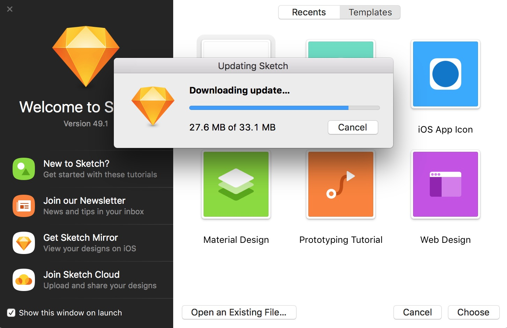
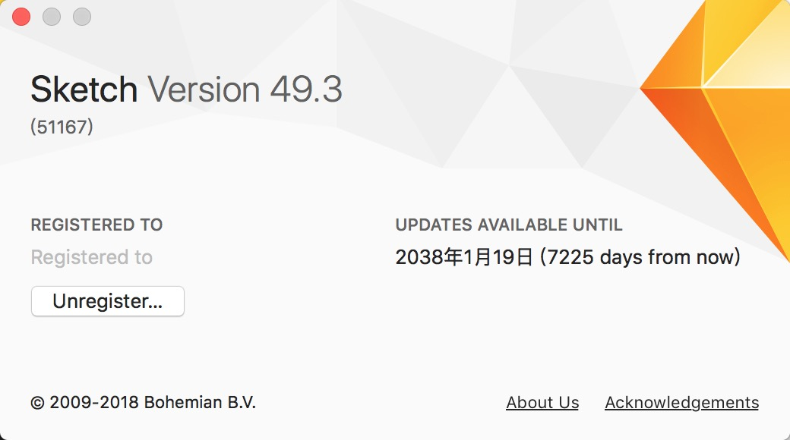

# Sketch破解

[Sketch](https://www.sketchapp.com/) 最新版(49.3)破解。Sketch是一款轻量，易用的矢量设计工具。    
1:HookIE 为破解源码.       
2:SketchI.app 为成果物。这里我们构造了一个.app，里面有hook的dylib，通过启动这个app完成对iExplorer的无侵入hook。之所以这么做而不是insertdylib到可执行文件，是因为Sketch还在持续更新。

